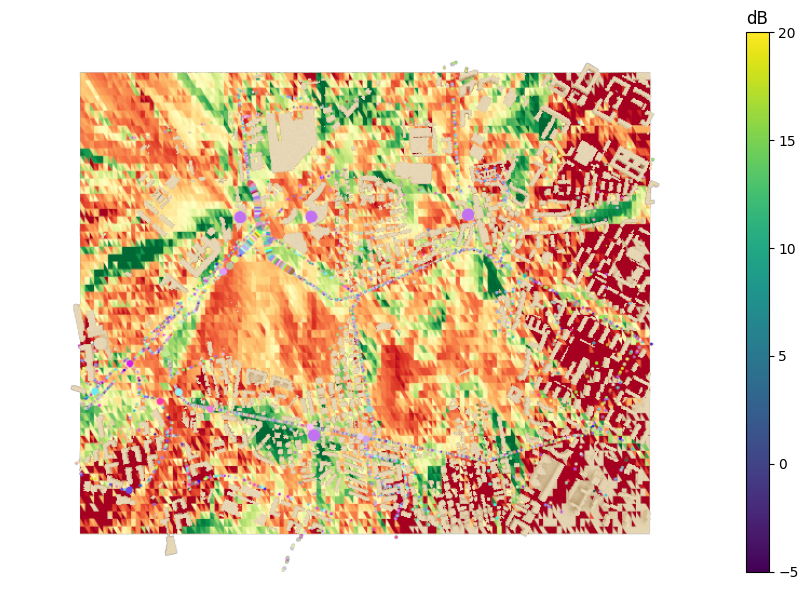

To replicate the steps: 
1. preinstall SUMO with Eclipse from original source
2. Produce scene in Blender Blosm, copy coordinates (format: 20.93835,52.19885,20.97230,52.21542)
3. Run osmWebWizard.py from this repo
4. Web browser should appear
5. Paste coordinates to "Select Area"
6. Disable all not needed "road-types", e.g. leave Highway tab
7. Configurate scale of SUMO sim in "Vehicles" tab
8. Click "Generate Scenario"
9. sumo -c .\osm.sumocfg --fcd-output sumoTrace.xml   
9. Use template SUMO_example.ipynb to put SUMO into your Sionna notebook, put the correct path of sumoTrace.xml in example

file